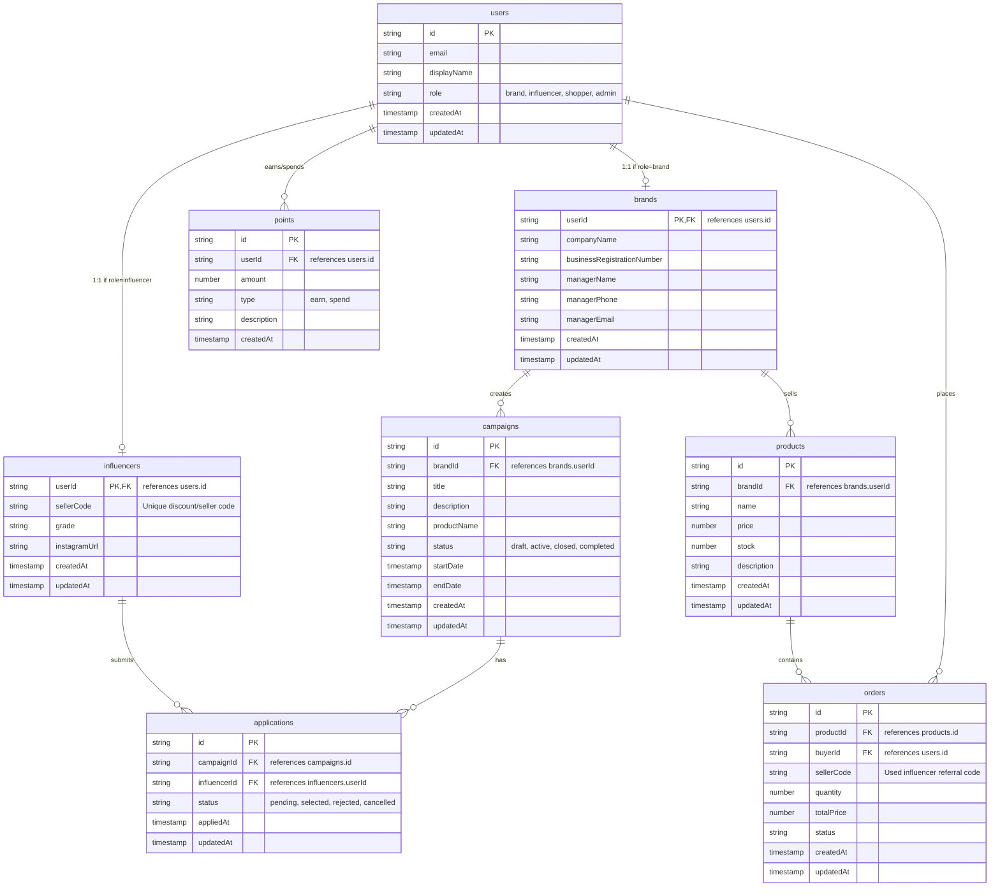

# 앤팅(Anting) 데이터베이스 ERD

```mermaid
erDiagram
    users {
        string id PK
        string email
        string displayName
        string role "brand, influencer, shopper, admin"
        timestamp createdAt
        timestamp updatedAt
    }
    
    brands {
        string userId PK, FK "references users.id"
        string companyName
        string businessRegistrationNumber
        string managerName
        string managerPhone
        string managerEmail
        timestamp createdAt
        timestamp updatedAt
    }
    
    influencers {
        string userId PK, FK "references users.id"
        string sellerCode "Unique discount/seller code"
        string grade
        string instagramUrl
        timestamp createdAt
        timestamp updatedAt
    }
    
    campaigns {
        string id PK
        string brandId FK "references brands.userId"
        string title
        string description
        string productName
        string status "draft, active, closed, completed"
        timestamp startDate
        timestamp endDate
        timestamp createdAt
        timestamp updatedAt
    }
    
    applications {
        string id PK
        string campaignId FK "references campaigns.id"
        string influencerId FK "references influencers.userId"
        string status "pending, selected, rejected, cancelled"
        timestamp appliedAt
        timestamp updatedAt
    }
    
    products {
        string id PK
        string brandId FK "references brands.userId"
        string name
        number price
        number stock
        string description
        timestamp createdAt
        timestamp updatedAt
    }

    orders {
        string id PK
        string productId FK "references products.id"
        string buyerId FK "references users.id"
        string sellerCode "Used influencer referral code"
        number quantity
        number totalPrice
        string status
        timestamp createdAt
        timestamp updatedAt
    }

    points {
        string id PK
        string userId FK "references users.id"
        number amount
        string type "earn, spend"
        string description
        timestamp createdAt
    }

    users ||--o| brands : "1:1 if role=brand"
    users ||--o| influencers : "1:1 if role=influencer"
    brands ||--o{ campaigns : "creates"
    brands ||--o{ products : "sells"
    campaigns ||--o{ applications : "has"
    influencers ||--o{ applications : "submits"
    users ||--o{ orders : "places"
    products ||--o{ orders : "contains"
    users ||--o{ points : "earns/spends"
```
